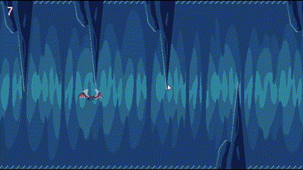

# Flappy Bat

This repository is a clone of the classic Flappy Bird game made in Godot 4.2. 

It's just an intro project into Godot, so feel free to use it as you like.

*** [PLAY HERE](https://suricatagames.com/flappybat/) ***

## Assets

The assets used in this code are public and free to use. To support the creators of those assets, instead of adding them directly, I will provide the links and instructions on how to use them in this project.

### Assets package

https://demonstick-games.itch.io/pixel-art-2d-flappy-bird-like

Copy the 'Animations', 'Audio', and 'Sprites' folders into the project's 'assets/FlappyBat' directory.

### Font

https://poppyworks.itch.io/silver

Copy the Silver.ttf into the 'assets' folder.